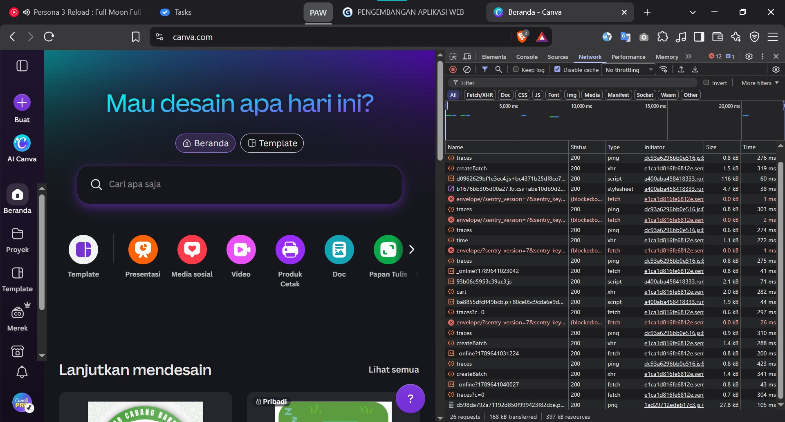

# Laporan Investigasi HTTP Request: Canva Web Application

## 1. Identifikasi Aplikasi

* **Nama Aplikasi**: Canva
* **URL Lengkap**: `https://www.canva.com/id_id/`
* **Portofolio Pengembang**: [https://yusmanalidzar.vercel.app](https://yusmanalidzar.vercel.app)

### Dekonstruksi Anatomi URL

| Komponen URL | Bagian Nilai | Penjelasan Teknis |
|---|---|---|
| **Skema / Protokol** | `https://` | Menggunakan Hypertext Transfer Protocol Secure (HTTPS) dengan enkripsi TLS/SSL untuk menjamin kerahasiaan dan integritas data antara peramban dan server. |
| **Subdomain** | `www` | Menandai rute host publik World Wide Web standar Canva. |
| **Domain Tingkat Kedua (SLD)** | `canva` | Nama identitas resmi dari platform entitas bisnis Canva. |
| **Domain Tingkat Atas (TLD)** | `.com` | Top-Level Domain komersial publik berskala global. |
| **Host / FQDN** | `www.canva.com` | Fully Qualified Domain Name lengkap tempat server origin melayani permintaan. |
| **Path** | `/id_id/` | Segmen rute direktori penentu lokalisasi wilayah geografis dan antarmuka bahasa Indonesia. |
| **Query String** | *(Tidak ada)* | Tidak terdapat parameter dinamis (key-value) pada pemuatan rute beranda awal. |
| **Fragment / Hash** | *(Tidak ada)* | Tidak ada penanda jangkar (anchor target) elemen DOM pada halaman awal. |

## 2. Tangkapan Layar Network Tab (DevTools)

## 3. Catatan dan Analisis 5 HTTP Request

| No | URL Endpoint | HTTP Method | Status Code | Content-Type | Keterangan dan Fungsi Request |
|:--:|---|:--:|:--:|---|---|
| 1 | `https://www.canva.com/id_id/` | `GET` | `200 OK` | `text/html; charset=utf-8` | Memuat berkas HTML awal yang bertindak sebagai kerangka dasar dokumen DOM sebelum script dieksekusi. |
| 2 | `https://static.canva.com/_next/static/css/core.css` | `GET` | `200 OK` | `text/css; charset=utf-8` | Mengunduh lembar gaya global (stylesheet) untuk mendefinisikan tata letak, variabel desain, tipografi, dan tema antarmuka. |
| 3 | `https://static.canva.com/_next/static/chunks/main-app.js` | `GET` | `200 OK` | `application/javascript; charset=utf-8` | Mengambil bundle JavaScript utama aplikasi untuk memicu hidrasi antarmuka komponen client-side. |
| 4 | `https://www.canva.com/_ajax/users/me` | `GET` | `200 OK` | `application/json; charset=utf-8` | Melakukan pemanggilan asynchronous (XHR/Fetch) untuk memeriksa status otentikasi sesi aktif pengguna dan preferensi profil. |
| 5 | `https://www.canva.com/_ajax/telemetry` | `POST` | `204 No Content` | `application/json; charset=utf-8` | Mengirimkan paket log metrik performa browser, waktu muat aset, serta data analitik interaksi ke server telemetry. |

## 4. Analisis Dugaan Arsitektur Sistem

### A. Komponen Frontend
* **Teknologi**: React, TypeScript, HTML5 Canvas API, dan WebGL.
  * Struktur chunk berkas JavaScript yang dipecah secara modular menunjukkan penggunaan pustaka React dan build tools modern (seperti Webpack atau esbuild).
  * Editor desain Canva memerlukan rendering performa tinggi tanpa lag. Untuk manipulasi elemen vektor, teks, dan gambar pada kanvas kerja, Canva memanfaatkan WebGL dan Canvas API agar pemrosesan grafis dibebankan pada akselerasi perangkat keras (GPU) peramban pengguna.

### B. Komponen Backend
* **Teknologi**: Java / Kotlin (Microservices), Go, Node.js, serta Edge CDN (Cloudflare / AWS CloudFront).
  * Canva secara resmi mengadopsi arsitektur microservices berskala besar yang sebagian besar dibangun di atas ekosistem JVM (Java/Kotlin) untuk keandalan transaksi data tingkat tinggi dan Go untuk pemrosesan mikro yang membutuhkan konkurensi kilat.
  * Aset statis disajikan melalui subdomain `static.canva.com` yang memanfaatkan Content Delivery Network (CDN) global. Hal ini terlihat dari header respon cache (`cf-cache-status` atau atribut `Via`) yang memangkas waktu latensi geografis pengguna di seluruh dunia.

### C. Komponen Basis Data dan Penyimpanan
* **Teknologi**: PostgreSQL / MySQL terdistribusi (Amazon Aurora), Redis, dan Amazon Web Services (AWS) S3.
  * **Relational Database**: Diperlukan untuk menjamin integritas relasional data pengguna, lisensi langganan, hak akses tim, dan metadata proyek secara ACID.
  * **In-Memory Cache (Redis)**: Digunakan untuk manajemen sesi kilat, rate limiting API, dan caching data pengguna yang sering diakses.
  * **Object Storage (Amazon S3)**: Canva menyimpan miliaran gambar, font, elemen grafis mentah, serta berkas hasil ekspor pengguna yang memerlukan skalabilitas penyimpanan objek nirbatas dan aman.

## 5. Metadata Pengumpulan

* **Mata Kuliah**: Pengembangan Aplikasi Web
* **Tautan Repositori GitHub**: [github.com/yusmanalidzar/](https://github.com/yusmanalidzar/)
* **Portal Tugas**: [https://yusmanalidzar.vercel.app/tugas](https://yusmanalidzar.vercel.app/tugas)